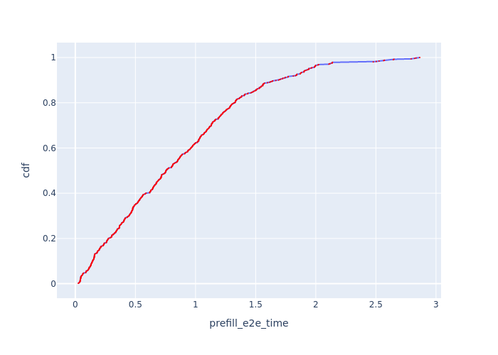
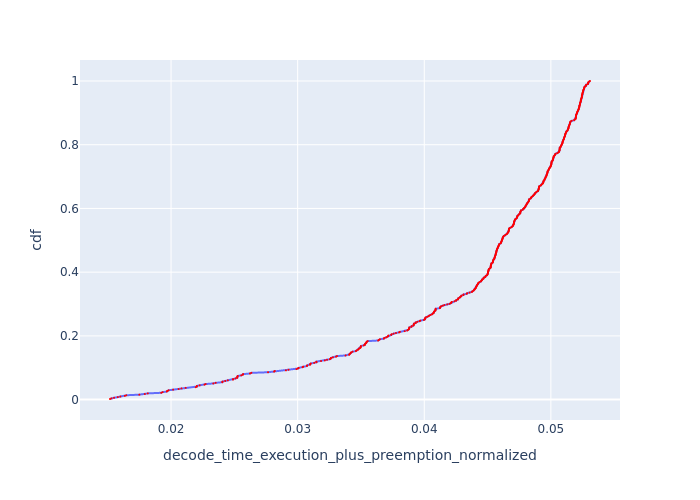
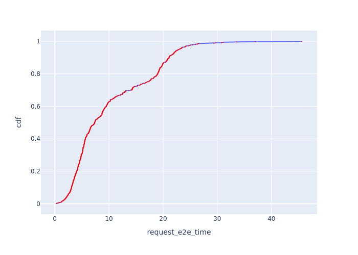
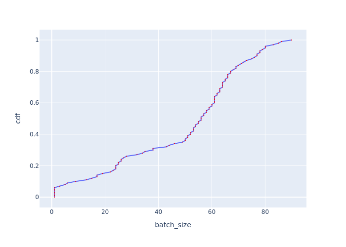

# 🚀 Vidur-Arc2: 智能调度器项目 - 负载均衡优化版

## 📋 最新更新 (arc2分支)

### 🎯 负载均衡优化训练 (推荐)

解决PPO训练初期负载极度不均衡问题的优化版本：

```bash
# 启动优化的热身训练 (推荐)
bash scripts/train_ppo_warmstart_optimized.sh
```

**核心优化改进**：
- **🔥 压制warmup随机性**: `entropy_warmup_coef=0.0`, `min_temperature=0.5`
- **🔗 强化KL约束**: `initial=0.6`, `final=0.1`, `decay=3000步`
- **⚖️ 加强负载惩罚**: `balance_penalty=0.3`, `load_balance=0.3`
- **📊 混合策略示教**: Round Robin + LOR + Random + 极端不均衡场景
- **🔄 智能Resume**: 交互式checkpoint恢复，自动跳过warmstart

### 🔄 Resume训练功能

支持从checkpoint智能恢复训练：

```bash
# 运行训练脚本时会自动检测checkpoint
bash scripts/train_ppo_warmstart_optimized.sh

# 如果发现checkpoint，会提示选择：
🔄 发现existing checkpoint: ./outputs/checkpoints/latest.pt
🤔 是否从checkpoint恢复训练? (这将跳过warmstart阶段)
   y/Y) 从checkpoint恢复  ← 推荐，节省时间
   n/N) 重新开始完整训练
   q/Q) 退出脚本
```

### 📈 调度器性能对比

快速测试不同调度器的性能对比：

```bash
# 运行调度器对比测试
bash scripts/scheduler_comparison.sh

# 查看实时训练监控
tensorboard --logdir=./outputs/warmstart_training_optimized/run_*/tensorboard --port=6006
```

### 🏗️ 项目架构改进

**模块化设计** (遵循CLAUDE.md规范)：
```
scripts/                           # 简洁的脚本文件 (<50行)
├── train_ppo_warmstart_optimized.sh  # 优化训练主脚本
├── scheduler_comparison.sh           # 调度器对比测试
└── collect_demo.py                   # 示教数据收集

src/                               # 核心逻辑模块
├── demo_collection/               # 示教数据收集模块
│   ├── mixed_collector.py         # 混合策略收集器
│   └── __init__.py
└── rl_components/                 # RL训练组件
    ├── ppo_trainer.py             # PPO训练器
    ├── checkpoint_manager.py      # Checkpoint管理
    └── ...

vidur/scheduler/global_scheduler/  # 调度器实现
├── ppo_scheduler_modular.py       # 模块化PPO调度器
└── ...
```

### 📊 训练流程详解

**阶段1: 示教数据收集**
```bash
# 混合策略数据收集 (自动执行)
python -m src.demo_collection.mixed_collector \
  --policies round_robin lor random \
  --steps_per_policy 700 \
  --include_imbalanced  # 包含极端不均衡场景
```

**阶段2: 行为克隆预训练**
```bash
# BC预训练 (自动执行)
python scripts/pretrain_actor.py \
  --demo demo_data.pkl \
  --epochs 30 \
  --batch_size 256
```

**阶段3: PPO强化学习**
```bash
# PPO训练 (自动执行)
python -m vidur.main \
  --global_scheduler_config_type ppo_modular \
  --p_p_o_global_scheduler_modular_config_enable_warm_start \
  --p_p_o_global_scheduler_modular_config_pretrained_actor_path pretrained_actor.pt
```

### ⚙️ 关键参数说明

**负载均衡优化参数**：
- `entropy_warmup_coef=0.0`: 消除warmup期间的随机性
- `kl_ref_coef_initial=0.6`: 强KL约束，贴近示教策略
- `kl_ref_decay_steps=3000`: 延长KL衰减期
- `balance_penalty_weight=0.3`: 加强负载均衡惩罚
- `alpha=0.2`: 降低throughput权重，避免压制均衡惩罚

**监控指标**：
- **TensorBoard**: `http://localhost:6006`
- **CSV导出**: `./outputs/warmstart_training_optimized/run_*/metrics/`
- **Checkpoint**: `./outputs/checkpoints/latest.pt`

### 📚 详细技术文档

- **[负载均衡优化技术文档](docs/load_balance_optimization.md)** - 详细的优化策略和技术实现
- **[项目开发规范](/.claude/CLAUDE.md)** - 代码规范和模块化标准
- **[调度器实现文档](vidur/scheduler/global_scheduler/)** - PPO调度器核心实现

---

## 🛠️ 传统训练方式 (参考)

python -m vidur.main `
  --cluster_config_num_replicas 4 `
  --global_scheduler_config_type ppoonline `
  --p_p_o_global_scheduler_online_config_debug_dump_global_state `
  --p_p_o_global_scheduler_online_config_max_queue_requests_per_replica 8 `  #控制拼接state的req数量
  --p_p_o_global_scheduler_online_config_lr 0.0003 `
  --p_p_o_global_scheduler_online_config_gamma 0.95 `
  --p_p_o_global_scheduler_online_config_reward_latency_weight 1.5 `
  --p_p_o_global_scheduler_online_config_balance_penalty_weight 0 `
  --p_p_o_global_scheduler_online_config_entropy_coef 0.002 ` #控制探索衰减
  --synthetic_request_generator_config_num_requests 500 `
  --interval_generator_config_type poisson `
  --poisson_request_interval_generator_config_qps 2 `
  --metrics_config_subsamples 200000 `
  *> .\run.log

所有可调超参见\vidur\vidur\config\config.py


# Vidur: LLM Inference System Simulator

Vidur is a high-fidelity and extensible LLM inference system simulator. It can help you with:

1. Study the system performance of models under different workloads and configurations.

    | TTFT | TPOT | Request E2E Time | Batch Size |
    | --- | --- | --- | --- |
    |  |  |  |  |

    *`Llama-3-8B` running the [AzureLLMInferenceTrace2023_conv](https://github.com/Azure/AzurePublicDataset/blob/master/data/AzureLLMInferenceTrace_conv.csv) trace on single `A100 80GB` at 6.45 QPS*

1. Capacity planning and finding the best deployment configuration for your LLM deployments.
   
*Capacity per dollar for different deployment configurations vs TTFT-P90 and TBT-P99 for LLaMA2-70B.*
1. Quickly test new research ideas like new scheduling algorithms, optimizations like speculative decoding, etc.

... all without access to GPUs except for a quick initial profiling phase 🎉. We highly recommend checking out our [MLSys'24 paper](https://arxiv.org/abs/2405.05465) and [talk](https://mlsys.org/virtual/2024/poster/2667) for more details.


## Supported Models

__Instructions on adding a new model to existing or new SKUs can be found [here](docs/profiling.md)__.

| Model / Device | A100 80GB DGX | H100 DGX | 4xA100 80GB Pairwise NVLink Node | 8xA40 Pairwise NVLink Node |
| --- | --- | --- | --- | --- |
| `meta-llama/Meta-Llama-3-8B` | ✅ | ❌ | ✅ | ❌ |
| `meta-llama/Meta-Llama-3-70B` | ✅ | ❌ | ✅ | ❌ |
| `meta-llama/Llama-2-7b-hf` | ✅ | ✅ | ✅ | ✅ |
| `codellama/CodeLlama-34b-Instruct-hf"` | ✅ | ✅ | ✅ | ✅ |
| `meta-llama/Llama-2-70b-hf` | ✅ | ✅ | ✅ | ✅ |
| `internlm/internlm-20b` | ✅ | ✅ | ✅ | ✅ |
| `Qwen/Qwen-72B` | ✅ | ✅ | ✅ | ✅ |

* All models support a maximum context length of 4k except `Llama3-8B` and `Llama3-70B` which support 16k context length by passing additional CLI params:

    ```text
    --random_forrest_execution_time_predictor_config_prediction_max_prefill_chunk_size 16384 \
    --random_forrest_execution_time_predictor_config_prediction_max_batch_size 512 \
    --random_forrest_execution_time_predictor_config_prediction_max_tokens_per_request 16384
    ```

* Pipeline parallelism is supported for all models. The PP dimension should divide the number of layers in the model.
* In DGX nodes, there are 8 GPUs, fully connected via NVLink. So TP1, TP2, TP4 and TP8 are supported.
* In 4x pairwise NVLink nodes, there are 4 GPUs, so TP1, TP2 and TP4 are supported. TP4 here is less performant than TP4 in DGX nodes because (GPU1, GPU2) are connected via NVLink and (GPU3, GPU4) are connected via NVLink. but between these layers, the interconnect is slower.
* You can use any combination of TP and PP. For example, you can run LLaMA2-70B on TP2-PP2 on a 4xA100 80GB Pairwise NVLink Node.

## Setup

### Using `mamba`

To run the simulator, create a mamba environment with the given dependency file.

```sh
mamba env create -p ./env -f ./environment.yml
mamba env update -f environment-dev.yml
```

### Using `venv`

1. Ensure that you have Python 3.10 installed on your system. Refer <https://www.bitecode.dev/p/installing-python-the-bare-minimum>
2. `cd` into the repository root
3. Create a virtual environment using `venv` module using `python3.10 -m venv .venv`
4. Activate the virtual environment using `source .venv/bin/activate`
5. Install the dependencies using `python -m pip install -r requirements.txt`
6. Run `deactivate` to deactivate the virtual environment

### Using `conda` (Least recommended)

To run the simulator, create a conda environment with the given dependency file.

```sh
conda env create -p ./env -f ./environment.yml
conda env update -f environment-dev.yml
```

### Setting up wandb (Optional)

First, setup your account on `https://<your-org>.wandb.io/` or public wandb, obtain the api key and then run the following command,

```sh
wandb login --host https://<your-org>.wandb.io
```

To opt out of wandb, pick any one of the following methods:

1. `export WANDB_MODE=disabled` in your shell or add this in `~/.zshrc` or `~/.bashrc`. Remember to reload using `source ~/.zshrc`.
2. Set `wandb_project` and `wandb_group` as `""` in `vidur/config/default.yml`. Also, remove these CLI params from the shell command with which the simulator is invoked.

## Running the simulator

To run the simulator, execute the following command from the repository root,

```sh
python -m vidur.main
```

or a big example with all the parameters,

```sh
python -m vidur.main  \
--replica_config_device a100 \
--replica_config_model_name meta-llama/Meta-Llama-3-8B \
--cluster_config_num_replicas 1 \
--replica_config_tensor_parallel_size 1 \
--replica_config_num_pipeline_stages 1 \
--request_generator_config_type synthetic \
--synthetic_request_generator_config_num_requests 512  \
--length_generator_config_type trace \
--trace_request_length_generator_config_max_tokens 16384 \
--trace_request_length_generator_config_trace_file ./data/processed_traces/splitwise_conv.csv \
--interval_generator_config_type poisson \
--poisson_request_interval_generator_config_qps 6.45 \
--replica_scheduler_config_type sarathi  \
--sarathi_scheduler_config_batch_size_cap 512  \
--sarathi_scheduler_config_chunk_size 512 \
--random_forrest_execution_time_predictor_config_prediction_max_prefill_chunk_size 16384 \
--random_forrest_execution_time_predictor_config_prediction_max_batch_size 512 \
--random_forrest_execution_time_predictor_config_prediction_max_tokens_per_request 16384
```

or to get information on all parameters,

```sh
python -m vidur.main -h
```

## Simulator Output

* The metrics will be logged to wandb directly and a copy will be stored in the `simulator_output/<TIMESTAMP>` directory. __A description of all the logged metrics can be found [here](docs/metrics.md).__
* Vidur exports chrome traces of each simulation. The trace can be found in the `simulator_output` directory. The trace can be opened by navigating to `chrome://tracing/` or `edge://tracing/` and loading the trace.

    

## Formatting Code

To format code, execute the following command:

```sh
make format
```

## Using Canary Build

We have been working on several improvements for the simulator, including support for prefix caching, different routing policies, reducing memory requirements for the simulator, etc. However, there are some sharp edges that we are working on resolving. In the meantime, if you are looking for support for any of these features, please use the `canary` branch.

## Contributing

This project welcomes contributions and suggestions.  Most contributions require you to agree to a
Contributor License Agreement (CLA) declaring that you have the right to, and actually do, grant us
the rights to use your contribution. For details, visit https://cla.opensource.microsoft.com.

When you submit a pull request, a CLA bot will automatically determine whether you need to provide
a CLA and decorate the PR appropriately (e.g., status check, comment). Simply follow the instructions
provided by the bot. You will only need to do this once across all repos using our CLA.

This project has adopted the [Microsoft Open Source Code of Conduct](https://opensource.microsoft.com/codeofconduct/).
For more information see the [Code of Conduct FAQ](https://opensource.microsoft.com/codeofconduct/faq/) or
contact [opencode@microsoft.com](mailto:opencode@microsoft.com) with any additional questions or comments.

## Trademarks

This project may contain trademarks or logos for projects, products, or services. Authorized use of Microsoft 
trademarks or logos is subject to and must follow 
[Microsoft's Trademark & Brand Guidelines](https://www.microsoft.com/en-us/legal/intellectualproperty/trademarks/usage/general).
Use of Microsoft trademarks or logos in modified versions of this project must not cause confusion or imply Microsoft sponsorship.
Any use of third-party trademarks or logos are subject to those third-party's policies.


